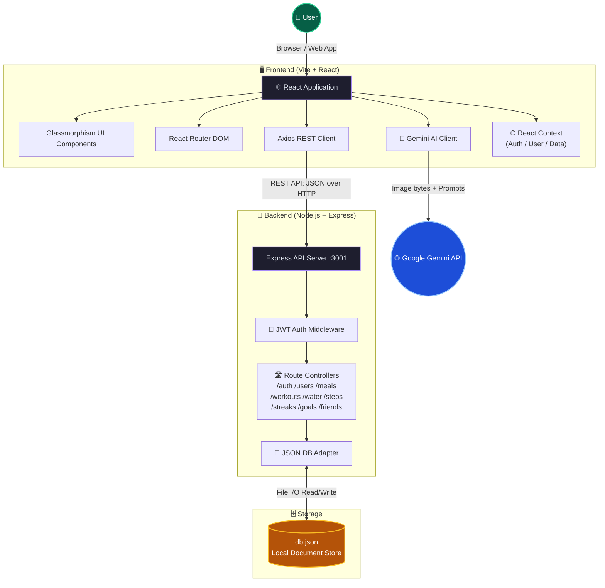
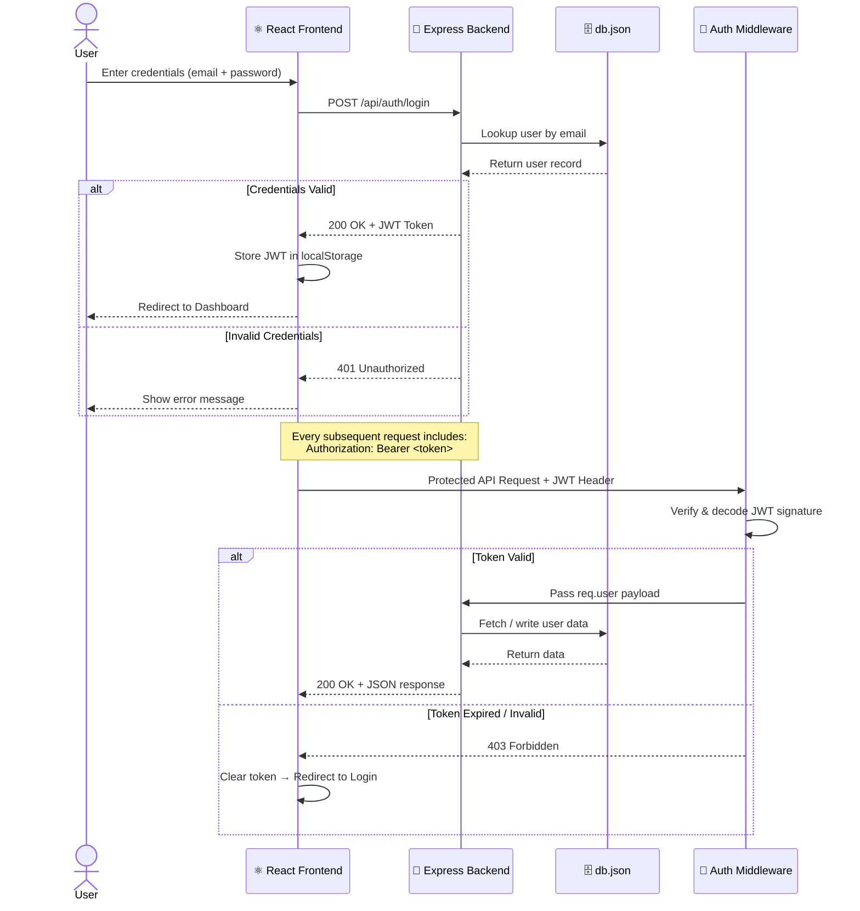
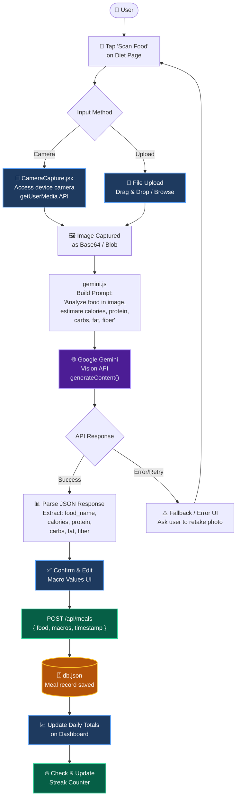
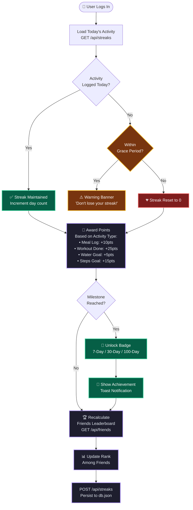
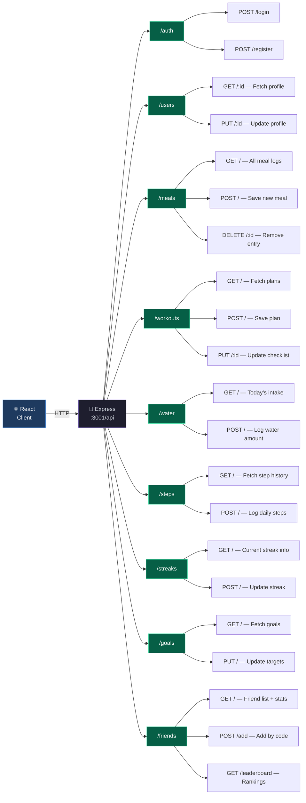
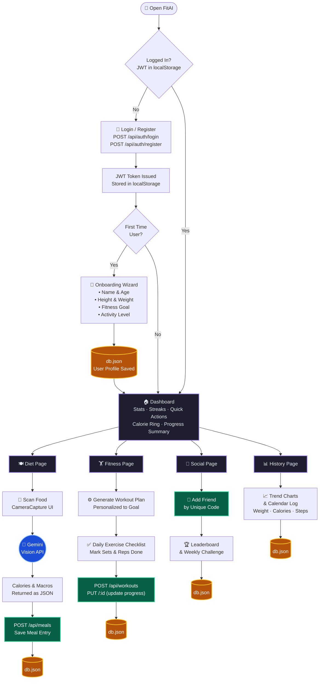
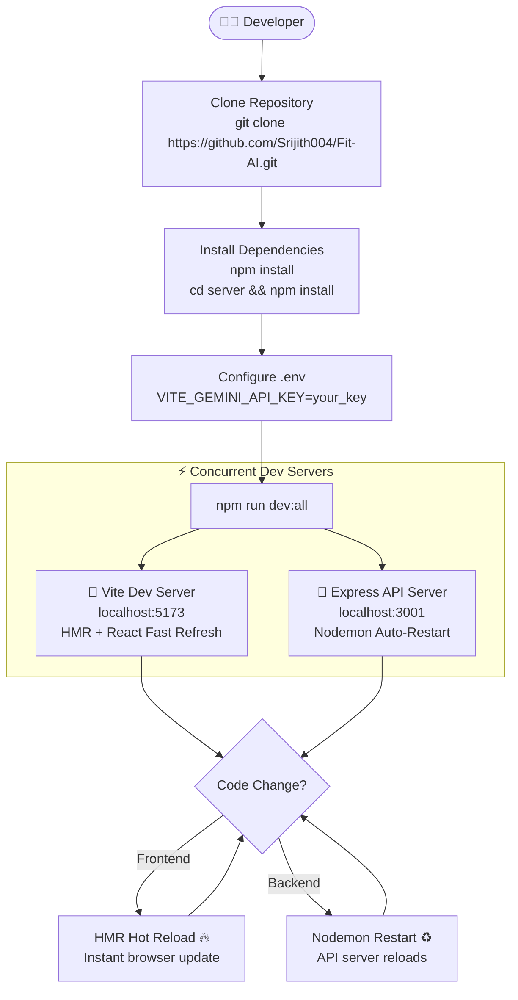

# FitAI: Your AI-Powered Fitness & Diet Planner 💪🧠

<div align="center">

[](https://github.com/Srijith004/Fit-AI/stargazers)
[](https://github.com/Srijith004/Fit-AI/forks)
[](https://github.com/Srijith004/Fit-AI/issues)
[](https://github.com/Srijith004/Fit-AI/blob/main/LICENSE)

**[🌐 View on GitHub](https://github.com/Srijith004/Fit-AI)** · **[🐛 Report Bug](https://github.com/Srijith004/Fit-AI/issues/new)** · **[✨ Request Feature](https://github.com/Srijith004/Fit-AI/issues/new)**

</div>

---

> **FitAI** is a modern, full-stack web application designed to help users track their fitness journey, manage their diet, and compete with friends — all powered by an intuitive Glassmorphism UI and Google Gemini AI.

---

## 🌟 Key Features

| Feature | Description |
|---|---|
| 🍽️ **AI Meal Scanner** | Snap a photo of food → Gemini Vision API estimates calories & macros instantly |
| 🏋️ **Smart Workout Plans** | Personalized routines auto-generated for your goals (Gain, Lose, Maintain) |
| 🔥 **Streak System** | Daily activity streaks with gamified rewards to drive habit formation |
| 👥 **Social Competition** | Connect with friends via unique codes, view leaderboards & challenge others |
| 💧 **Full Health Tracking** | Log water intake, steps, weight, and all key vitals in one place |
| 📊 **History & Analytics** | Visualize trends with historical charts, calendar logs & progress reports |
| 🔐 **JWT Auth** | Secure token-based authentication with protected route middleware |

---

## 🏗️ System Architecture

High-level overview of how the client, API server, AI services, and storage interact:



---

## 🔐 Authentication & Session Flow

Tracks how a user is verified, granted a JWT, and how that token protects every subsequent API call:



---

## 🤖 AI Meal Analysis Pipeline

Detailed flow of how a food photo becomes a structured macro breakdown:



---

## 🏆 Gamification & Streak Engine

How FitAI's gamification loop drives daily habits and social competition:



---

## 🛣️ API Routes Map

Complete overview of all backend REST endpoints:



---

## 🔄 Full User Journey

End-to-end experience from first visit to active daily use:



---

## ⚡ Development Lifecycle



---

## 🛠️ Tech Stack

### Frontend
| Technology | Purpose |
|---|---|
| **React 18** | Component-based UI framework |
| **Vite** | Lightning-fast dev server & bundler |
| **React Router DOM** | Client-side SPA routing |
| **Lucide React** | Clean, consistent icon set |
| **Vanilla CSS** | Custom Glassmorphism design system |
| **@google/generative-ai** | Gemini Vision API integration |

### Backend
| Technology | Purpose |
|---|---|
| **Node.js** | JavaScript runtime |
| **Express.js** | REST API framework |
| **JSON Web Tokens (JWT)** | Stateless auth tokens |
| **CORS** | Cross-origin request handling |
| **db.json (custom adapter)** | Lightweight file-based persistence |

---

## 🚀 Getting Started

### Prerequisites
- [Node.js](https://nodejs.org/) v16.x or newer
- npm or yarn
- A **Google Gemini API Key** → [Get one here](https://aistudio.google.com/app/apikey)

### 1. Clone the Repository
```bash
git clone https://github.com/Srijith004/Fit-AI.git
cd Fit-AI
```

### 2. Install Dependencies
```bash
# Root (concurrently + frontend deps)
npm install

# Backend deps
cd server && npm install && cd ..
```

### 3. Configure Environment Variables
Create a `.env` file in the **root** directory:
```env
VITE_GEMINI_API_KEY=your_gemini_api_key_here
```

### 4. Run the Application
```bash
npm run dev:all
```
| Service | URL |
|---|---|
| 🎨 Frontend | http://localhost:5173 |
| 🚀 Backend API | http://localhost:3001 |

---

## 📂 Project Structure

```
📦 Fit-AI/
│
├── 📄 index.html                   # App HTML shell / entry point
├── 📄 vite.config.js               # Vite build & dev server config
├── 📄 package.json                 # Root scripts (dev:all via concurrently)
├── 📄 .env                         # 🔑 Gemini API Key (not committed)
├── 📄 .gitignore                   # Git ignore rules
│
├── 📁 src/                         # ⚛️  React Frontend Source
│   ├── 📄 main.jsx                 # React DOM root renderer
│   ├── 📄 App.jsx                  # Route definitions & layout wrapper
│   ├── 📄 index.css                # Global styles & Glassmorphism tokens
│   │
│   ├── 📁 pages/                   # 🖥️  Full-page route views
│   │   ├── 📄 Login.jsx            # Auth — login & register forms
│   │   ├── 📄 Onboarding.jsx       # New-user profile & goals wizard
│   │   ├── 📄 Dashboard.jsx        # Home — stats, streaks & overview
│   │   ├── 📄 Diet.jsx             # AI food scan & meal log
│   │   ├── 📄 Fitness.jsx          # Workout plans & exercise tracker
│   │   ├── 📄 Social.jsx           # Friends, leaderboard & challenges
│   │   └── 📄 History.jsx          # Historical logs & trend charts
│   │
│   ├── 📁 components/              # 🧩  Reusable UI components
│   │   ├── 📄 Layout.jsx           # App shell with sidebar navigation
│   │   ├── 📄 GlassCard.jsx        # Glassmorphism card primitive
│   │   ├── 📄 ProgressBar.jsx      # Animated progress indicator
│   │   └── 📄 CameraCapture.jsx    # Camera / image-upload for AI scan
│   │
│   ├── 📁 context/                 # 🌐  React Context (global state)
│   │   ├── 📄 AuthContext.jsx      # Authentication state & JWT helpers
│   │   ├── 📄 UserContext.jsx      # User profile & preferences
│   │   └── 📄 DataContext.jsx      # Meals, workouts & health data
│   │
│   ├── 📁 hooks/                   # 🪝  Custom React hooks
│   │   └── 📄 useStepCounter.js    # Pedometer / step-count hook
│   │
│   └── 📁 lib/                     # 🛠️  Utility & API helpers
│       ├── 📄 api.js               # Axios client & REST API wrappers
│       └── 📄 gemini.js            # Google Gemini Vision AI integration
│
└── 📁 server/                      # 🚀  Node.js + Express Backend
    ├── 📄 index.js                 # Express app entry & server bootstrap
    ├── 📄 db.js                    # JSON file-based DB adapter (CRUD)
    ├── 📄 db.json                  # 🗄️ Persistent local data store
    ├── 📄 package.json             # Backend-specific dependencies
    │
    ├── 📁 middleware/              # 🔐  Express middleware
    │   └── 📄 auth.js              # JWT verification middleware
    │
    └── 📁 routes/                  # 🛣️  API route controllers
        ├── 📄 auth.js              # POST /register  POST /login
        ├── 📄 users.js             # GET|PUT /users/:id  (profile)
        ├── 📄 meals.js             # GET|POST|DELETE /meals
        ├── 📄 workouts.js          # GET|POST|PUT /workouts
        ├── 📄 water.js             # GET|POST /water     (hydration)
        ├── 📄 steps.js             # GET|POST /steps     (activity)
        ├── 📄 streaks.js           # GET|POST /streaks
        ├── 📄 goals.js             # GET|PUT  /goals
        └── 📄 friends.js           # GET|POST /friends   (social)
```

---

## 🤝 Contributing

Contributions are welcome!

1. Fork the repository: [github.com/Srijith004/Fit-AI/fork](https://github.com/Srijith004/Fit-AI/fork)
2. Create a feature branch: `git checkout -b feature/your-feature-name`
3. Commit your changes: `git commit -m 'feat: add your feature'`
4. Push to the branch: `git push origin feature/your-feature-name`
5. Open a Pull Request at: [github.com/Srijith004/Fit-AI/pulls](https://github.com/Srijith004/Fit-AI/pulls)

Please report bugs at [github.com/Srijith004/Fit-AI/issues](https://github.com/Srijith004/Fit-AI/issues).

---

## 📝 License

This project is licensed under the **MIT License** — see the [LICENSE](https://github.com/Srijith004/Fit-AI/blob/main/LICENSE) file for details.

---

<div align="center">

Made with ❤️ by [Srijith](https://github.com/Srijith004) · ⭐ Star this repo if you found it useful!

**[🌐 github.com/Srijith004/Fit-AI](https://github.com/Srijith004/Fit-AI)**

</div>
