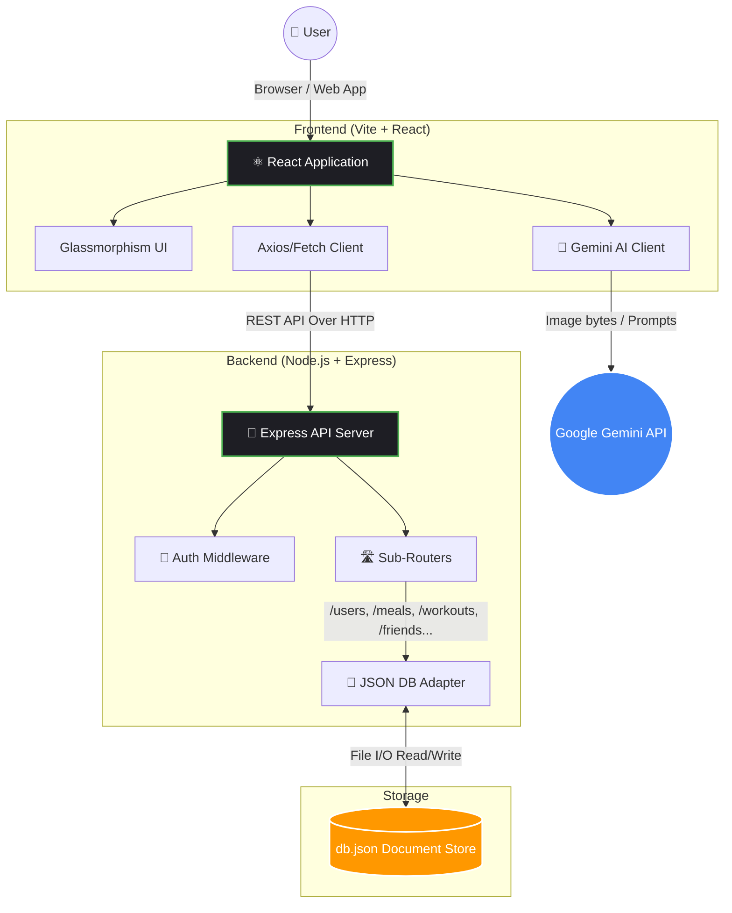

# FitAI: Your AI-Powered Fitness & Diet Planner 💪🧠

FitAI is a modern, full-stack web application designed to help users track their fitness journey, manage their diet, and compete with friends—all powered by an intuitive Glassmorphism UI and AI.

## 🌟 Key Features

### 🍽️ AI Calorie & Meal Tracking
- **Gemini Integration**: Snap a photo of your food, and FitAI's AI engine estimates your calories and macros using Google's Gemini Vision API.
- **Meal Logs**: Keep track of breakfast, lunch, dinner, and snacks with detailed nutritional information.

### 🏋️ Smart Workout Plans
- **Personalized Generation**: Automatically generate workout routines tailored to your specific goals (Muscle Gain, Weight Loss, Maintenance).
- **Daily Checklists**: Check off daily exercises and stay consistent.

### 🔥 Gamification & Social Streaks
- **Streaks**: Maintain your daily activity streaks to build long-lasting habits.
- **Friends & Competition**: Connect with friends via unique access codes. View leaderboards, compare stats, and stay motivated together.

### 💧 Health Metrics Tracking
- Log your daily water intake.
- Sync or log your daily step sequences.
- Track overarching fitness goals and progress over time.

---

## 🏗️ Architecture Flowchart

Below is a high-level flowchart of FitAI's full-stack architecture, showing how the client interacts with our REST API, AI services, and local database:

---

## 🛠️ Tech Stack

**Frontend:**
- **Framework**: React 18, Vite
- **Routing**: React Router DOM
- **Icons**: Lucide React
- **Styling**: Vanilla CSS (Dark Mode first, Custom Glassmorphism System)
- **AI**: `@google/generative-ai` (Gemini)

**Backend:**
- **Runtime**: Node.js
- **Framework**: Express.js
- **Middleware**: CORS, Express JSON parser
- **Database**: Custom lightweight JSON File Database (`db.json`) for persistence

---

## 🚀 Getting Started

Follow these instructions to set up FitAI locally on your machine.

### Prerequisites
- [Node.js](https://nodejs.org/) (v16.x or newer)
- npm or yarn
- A Google Gemini API Key (for the AI food scanning feature)

### 1. Clone the repository
\`\`\`bash
git clone https://github.com/Srijith004/Fit-AI.git
cd Fit-AI
\`\`\`

### 2. Install dependencies (Root, Frontend, and Backend)
\`\`\`bash
# This simple setup uses concurrently from the root directory
npm install
cd server && npm install && cd ..
\`\`\`

### 3. Setup Environment Variables
Create a `.env` file in the frontend/root directory and add your Gemini API Key:
\`\`\`env
VITE_GEMINI_API_KEY=your_gemini_api_key_here
\`\`\`

### 4. Start the Application
FitAI uses `concurrently` to boot both the React Frontend and the Node.js Express server with one command:
\`\`\`bash
npm run dev:all
\`\`\`

- **Frontend Application** will be live at: `http://localhost:5173`
- **Backend API Server** will be live at: `http://localhost:3001`

---

## 📂 Project Structure

\`\`\`text
Fit-AI/
├── src/                # React Frontend Source Code
│   ├── components/     # Reusable UI components
│   ├── pages/          # Full-page routing views
│   ├── lib/            # Utility functions (Gemini AI scripts)
│   ├── context/        # React Context providers for global state
│   └── App.jsx         # Main React application entry
├── server/             # Express.js Backend Core
│   ├── routes/         # Express endpoint controllers
│   ├── db.js           # JSON data parser and persistence logic
│   ├── index.js        # Backend entrypoint
│   └── db.json         # Local NoSQL-ish datastore
└── package.json        # Main project config & concurrently scripts
\`\`\`

## 🤝 Contributing
Contributions are welcome! Please fork the repository, submit issues, and send pull requests.

## 📝 License
This project is licensed under the MIT License.
